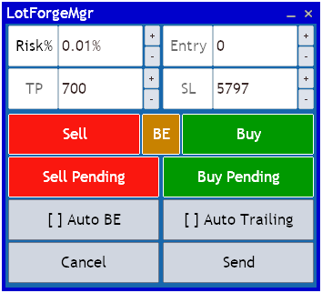
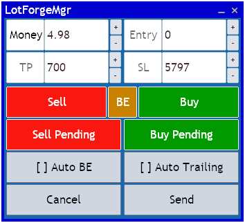
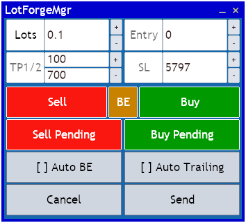

# LotForge Manager

### 🎯 Painel Visual de Risco, Entrada e Gestao para MT5

O **LotForge Manager** e um **position sizer e trade manager para MetaTrader 5** com preview grafico, execucao de ordens e acompanhamento da posicao aberta no proprio chart.

Ele foi pensado para deixar o fluxo mais rapido:

- definir a entrada
- calcular lote por `Lots`, `%` ou `Money`
- visualizar `SL`, `TP`, `TP1` e `TP2` antes do envio
- executar e continuar gerenciando a posicao aberta

---

## ✨ Visao Geral

O projeto na **v1.2** entrega:

- **Painel reorganizado** em layout compacto de duas colunas
- **3 modos de risco**: `Lots`, `Risk %` e `Money`
- **Ordens Market e Pending**
- **TP duplo** com `TP1` e `TP2`
- **Auto BE** e **Auto Trailing**
- **Preview visual no grafico** antes do envio
- **Markers textuais na posicao aberta**
- **Fluxo mais limpo**, com remocao do antigo botao `Algo Trading`

---

## 🖼️ Interface v1.2

### Modo Lots


### Modo Risk %



### Modo Money



### Preview com TP1 e TP2



---

## 🚀 Destaques da v1.2

- **Novo layout do painel**: inputs reorganizados para reduzir ruido visual e acelerar o uso no dia a dia.
- **Campo principal contextual**: o painel alterna entre lote fixo, risco percentual e risco financeiro sem trocar de fluxo.
- **TP1 / TP2 com parcial gerenciada**: o primeiro alvo realiza parcial e o segundo alvo finaliza a operacao restante.
- **Preview mais claro antes do envio**: entrada, stop e alvos ficam visiveis no grafico antes da execucao.
- **Mais robustez na operacao**: melhorias de persistencia, refresh visual e estabilidade no uso com ordens a mercado.
- **Experiencia mais objetiva**: o fluxo ficou mais direto com a remocao do botao `Algo Trading`.

---

## 🧩 Recursos Principais

- **Position Sizing**: `Lots`, `Risk %` e `Money`
- **Execucao**: `Buy`, `Sell`, `Buy Pending` e `Sell Pending`
- **Gestao**: `SL`, `TP`, `TP1 / TP2`, `Break-Even` e `Trailing Stop`
- **Visual**: preview de entrada e saida, zonas de risco e retorno, e markers textuais na posicao aberta

---

## 📈 Fluxo de Uso

1. Selecione o tipo de ordem.
2. Escolha o modo de risco: `Lots`, `%` ou `Money`.
3. Ajuste `Entry`, `SL`, `TP` ou `TP1/TP2`.
4. Revise o preview no grafico.
5. Clique em `Send`.
6. Gerencie a posicao com `Auto BE`, `Auto Trailing` e saídas por alvo.

---

## 🛡️ Estabilidade

Melhorias importantes ja incorporadas na linha atual:

- preservacao de estado em troca de timeframe
- menos redraw desnecessario durante drag e scroll
- melhor restauracao de sessao
- manutencao de `SL/TP` absolutos em ordens `market`
- correcoes de painel reaberto, overlap e consistencia visual

---

## 📁 Estrutura do Repo

```text
LotForge_Manager.mq5   # EA principal (v1.2)
LotForge/              # Modulos do projeto
docs/images/           # Capturas de referencia da interface
README.md              # Documentacao principal
```

---

## ⚙️ Instalacao

1. Copie `LotForge_Manager.mq5` para `MQL5/Experts/`
2. Copie a pasta `LotForge/` para `MQL5/Experts/LotForge/`
3. Compile `LotForge_Manager.mq5` no MetaEditor
4. Arraste o EA para um grafico no MT5

---

## 📝 Observacao

O calculo de risco percentual usa `ACCOUNT_BALANCE` como base.
